# Results: HNN vs. baselines on a bouncing ball

All models have ~41k parameters, share one dataset, one training loop, and one
evaluation harness. Trained on 200 trajectories at mass 1.0 kg, `dt = 0.01 s`,
2 s horizon, restitution `e = 0.8`. Reported on 50 held-out test trajectories.

## Headline

Both continuous-time models (HNN, Neural ODE) beat the discrete MLP by roughly
**300x** on rollout MSE and **five orders of magnitude** on the median
trajectory. But the HNN does **not** beat the plain Neural ODE — they are within
noise of each other, and the Neural ODE is slightly ahead while training 15%
faster. The interesting result of this project is *why* that happens, and it is
a direct consequence of the contact structure.

| Metric | MLP | HNN | Neural ODE |
| --- | --- | --- | --- |
| Rollout MSE | 5.816e-01 | 1.948e-03 | 1.945e-03 |
| Median trajectory MSE | 5.822e-01 | 3.572e-06 | 1.420e-06 |
| One-step derivative MSE | 2.340e-04 | 2.077e-05 | 4.657e-06 |
| Mean absolute energy drift [J] | 3.995e-01 | 3.237e-03 | 1.757e-03 |
| Elastic energy drift [J] | 4.709e-01 | 2.900e-03 | 4.920e-03 |
| Energy error during flight [J] | 6.849 | 0.0869 | 0.0671 |
| Energy error at contact [J] | 5.787 | 0.0470 | 0.0460 |
| Divergence rate at 10x horizon | 0.00 | 0.00 | 0.00 |
| Parameters | 41,202 | 41,001 | 41,202 |
| Train time [s] | 80 | 817 | 703 |

---

## 1. Rollout error vs. horizon

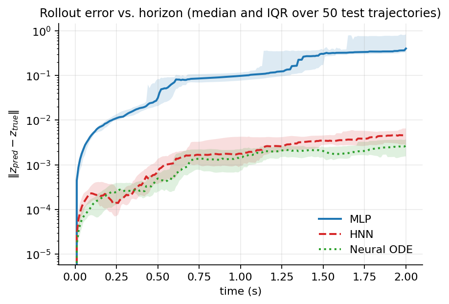

The MLP separates from the other two within the first 0.25 s and stays two
orders of magnitude worse for the rest of the rollout. All three curves show a
staircase: error jumps at bounces and grows slowly in between, because a bounce
amplifies whatever positional error already existed (hitting the floor at
slightly the wrong time changes the entire subsequent trajectory).

HNN and Neural ODE track each other almost exactly. This is the first sign that
the Hamiltonian prior is not buying anything here.

## 2. Energy over time (headline plot)

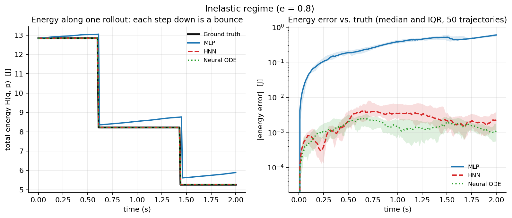

Ground truth is a staircase: perfectly flat during free flight, dropping by a
factor `e^2 = 0.64` in kinetic energy at each bounce. This is the plot that
shows the failure mode most directly.

The MLP visibly **gains** energy during free flight — the segments slope upward
where they should be flat. It has no structural reason to conserve anything, so
its one-step errors accumulate as a systematic energy injection. The HNN and
Neural ODE sit on top of ground truth at this scale; their mean absolute energy
error is smaller by 123x and 227x respectively.

## 3. Phase portraits

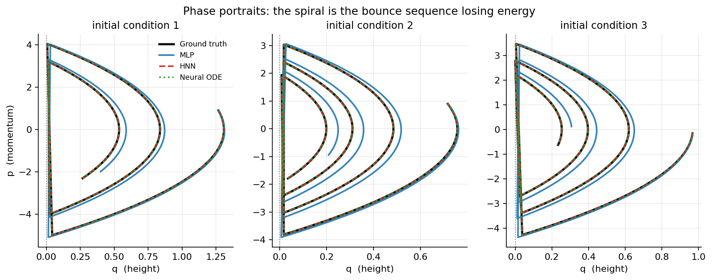

Each inward spiral is the bounce sequence losing energy. The vertical segments
at `q = 0` are the instantaneous momentum flips. The MLP's spiral is visibly
displaced from truth after the first bounce; HNN and Neural ODE overlay it.

## 4. Generalization to unseen mass

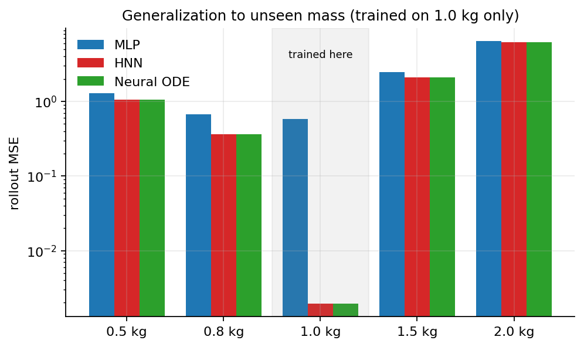

**This is the clearest negative result.** At the trained mass (1.0 kg) the HNN
and Neural ODE are ~300x better than the MLP. At every other mass, all three
collapse to roughly the same poor error:

| mass | 0.5 kg | 0.8 kg | 1.0 kg | 1.5 kg | 2.0 kg |
| --- | --- | --- | --- | --- | --- |
| MLP | 1.281 | 0.672 | 0.582 | 2.461 | 6.446 |
| HNN | 1.057 | 0.362 | **0.002** | 2.100 | 6.217 |
| Neural ODE | 1.063 | 0.362 | **0.002** | 2.101 | 6.255 |

The reason is structural, not a training failure: the models take only `(q, p)`
as input, and mass never appears. The true dynamics `dq/dt = p/m` genuinely
differ at a different mass, so no amount of physical prior can recover it from
`(q, p)` alone. The naive "generalization gap" ratio in `metrics.json` looks
*better* for the MLP (4.7x vs 1249x) purely because the MLP was already bad at
the trained mass — a ratio is the wrong summary here, and the absolute table
above is the honest one. Conditioning the models on mass is the obvious fix and
the natural next experiment.

## 5. HNN latent structure

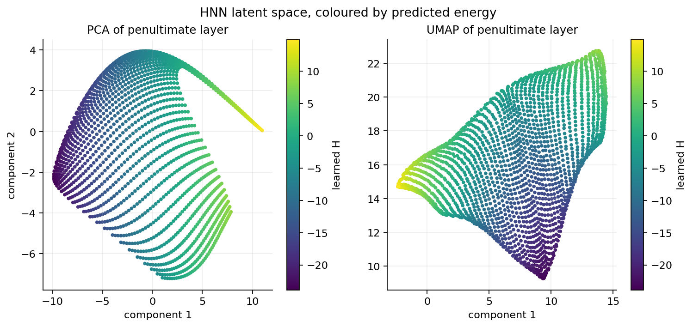

Penultimate-layer activations on a `(q, p)` grid, projected with PCA and UMAP
and coloured by the predicted `H`. Both projections are smooth, continuous
sheets with a monotone energy gradient and no fragmentation — the network has
learned a well-ordered energy manifold rather than memorising samples. The
striations are the grid sampling, not structure in the model.

## 6. Learned vector fields

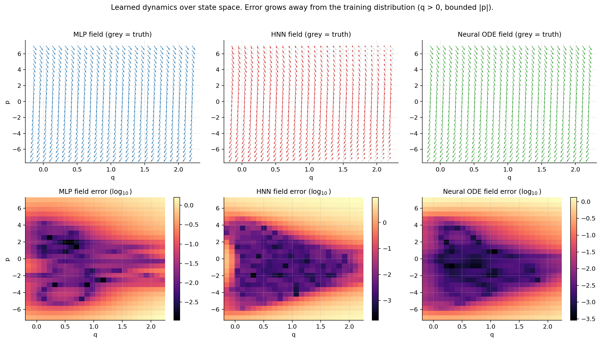

Top row: the learned field (colour) over ground truth (grey). Bottom row:
log-scale field error. The dark low-error region is a **triangle**, and that
triangle is exactly the physically reachable set — states satisfying
`p^2/2 + gq <= E_max` for the initial energies in the training data. Outside
it, every model degrades by 2-3 orders of magnitude.

This is what the aggregate error curves hide: the models are not uniformly
accurate over state space; they are accurate exactly where data lives. The MLP's
error region is visibly more ragged, with error structure even inside the
reachable set.

## 7. Learned Hamiltonian

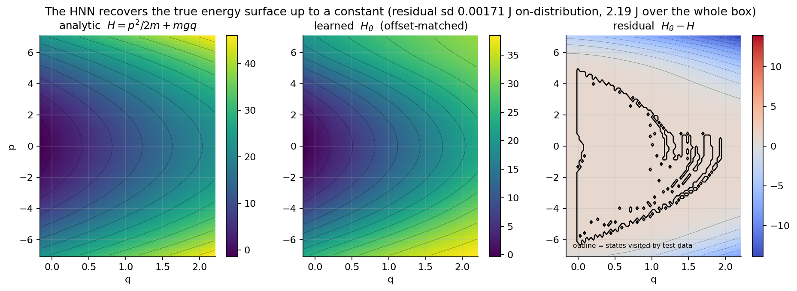

The HNN's scalar output recovers the analytic `H = p^2/2m + mgq` to a residual
standard deviation of **0.0017 J on-distribution**, against **2.19 J** over the
full plotted box. Since `H` is only defined up to an additive constant (the
dynamics depend on its gradient), the offset is matched before comparing; the
verification suite confirms this comparison is exact on a hand-set `H`.

So the HNN genuinely learns the right energy function where it has data. Its
failure to outperform the Neural ODE is not a failure to learn physics.

## 8. Naive vs. contact-aware rollout

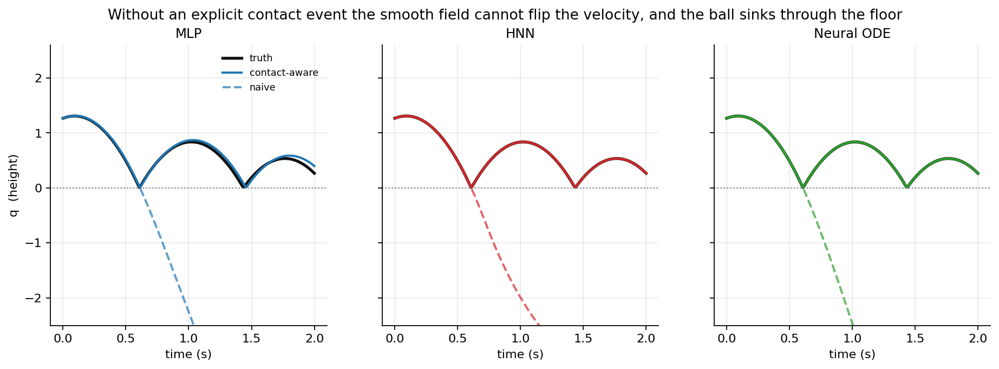

**Every model, without exception, fails completely without explicit contact
handling.** The dashed lines are naive rollouts: the ball passes through the
floor and falls forever. A continuous vector field is a smooth map, and no
smooth map can produce an instantaneous velocity reversal. This is a
representational impossibility, not an optimisation problem, and no amount of
training data fixes it.

The solid lines inject the known restitution rule `p <- -e p` at detected
crossings. This is the single change that makes the task solvable at all.

## 9. Where the energy error comes from

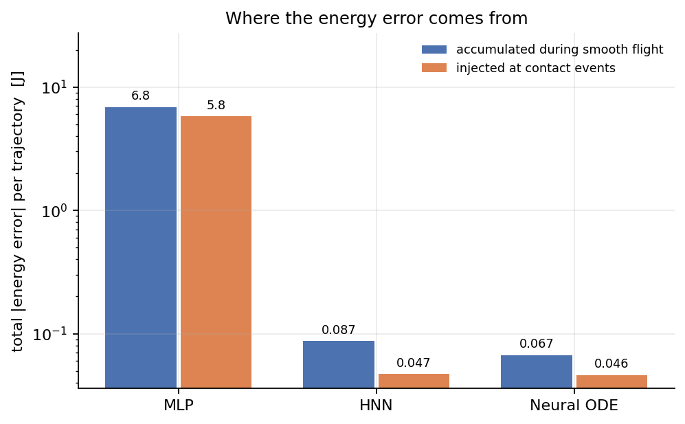

Splitting the accumulated energy error into the part acquired during smooth
flight and the part injected at contact events:

- MLP: 6.85 J in flight, 5.79 J at contact — it is bad everywhere.
- HNN: 0.087 J in flight, 0.047 J at contact.
- Neural ODE: 0.067 J in flight, 0.046 J at contact.

For the structured models **most of the remaining error accrues during smooth
flight, not at the bounces.** Because the restitution rule is injected exactly,
contact stops being the bottleneck once it is handled explicitly. This
quantifies the claim rather than asserting it, and it says the way to improve
these models further is better flight integration, not better contact handling.

## 10. Training curves

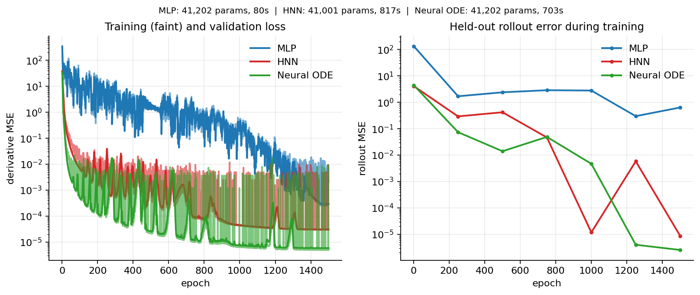

All three converge. The MLP's loss is noisier and plateaus two orders higher.
The cost asymmetry matters: the HNN takes **817 s vs the MLP's 80 s**, a 10x
penalty for the `create_graph=True` second-order autograd needed to
differentiate its own output — and it does not buy accuracy over the Neural
ODE's 703 s.

## 11. Elastic vs. inelastic ablation

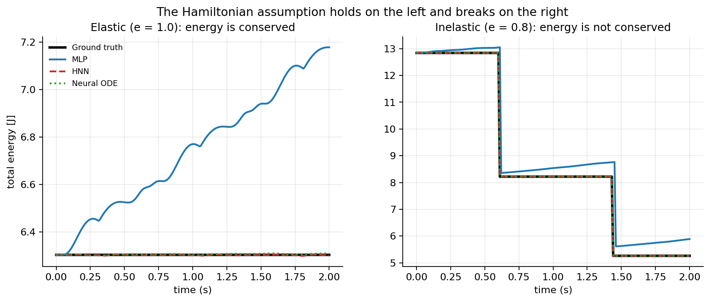

The cleanest isolation of the Hamiltonian assumption. On the left (`e = 1.0`)
true energy is exactly conserved and the system is genuinely Hamiltonian; on the
right (`e = 0.8`) it is not.

The MLP drifts **upward by ~14%** over 2 s in the elastic case, manufacturing
energy from nothing. The HNN and Neural ODE both hold the conserved value flat.
Notably the HNN's elastic drift (0.0029 J) is *lower* than the Neural ODE's
(0.0049 J) — this is the one metric where the Hamiltonian prior wins, and it
wins precisely in the regime where its assumption is exactly true.

## 12. Long-horizon stability

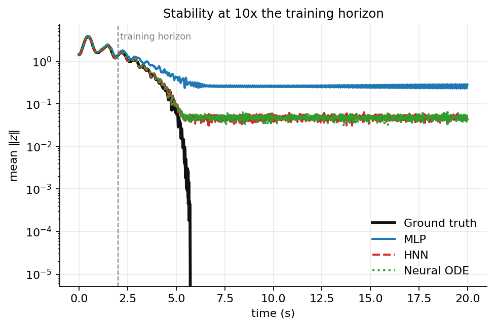

Rolled out to 10x the training horizon (20 s vs 2 s). **No model diverges** —
divergence rate 0.00 for all three, which is a real strength of the
contact-aware formulation.

But there is an honest failure here. Ground truth decays to *exactly* zero as
the ball comes to rest, while all three models plateau at a spurious floor
(~0.05 for HNN/Neural ODE, ~0.25 for the MLP) and keep jittering forever. None
of them learned that rest is an absorbing state — unsurprisingly, since the 2 s
training horizon never contained a settled ball. The models are stable but
converge to the wrong asymptotic state.

## 13. Per-trajectory error distribution

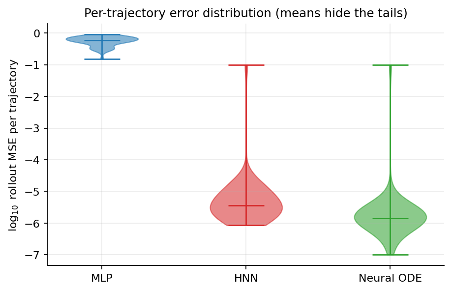

Mean rollout MSE (1.9e-3) and median (3.6e-6 for the HNN) differ by three orders
of magnitude, so the mean is being set by a handful of outlier trajectories, not
typical behaviour. The violins show why: the HNN and Neural ODE bodies sit near
1e-6 with a long upper tail reaching 1e-1. Those outliers are trajectories where
a small timing error near a bounce shifted the contact to a different timestep,
after which the two trajectories are simply out of phase. The MLP's distribution
is tight and uniformly bad, which is a different kind of failure.

---

## Interpretation

**Does the Hamiltonian prior help?** On this task, mostly no — and the reason is
informative. Once contact is handled explicitly, the remaining problem is free
flight under constant gravity, whose vector field is
`(dq/dt, dp/dt) = (p/m, -mg)`: *linear in the state and constant in the second
component*. That is close to the easiest possible target for any function
approximator. There is almost no room for a structural prior to add value,
because a generic MLP field learns it essentially perfectly. The HNN pays a 10x
training cost to encode a constraint that the unstructured continuous-time
baseline satisfies anyway.

Where the prior does show up is exactly where theory says it should: the elastic
(`e = 1`) case, where energy conservation is literally true, is the one metric
on which the HNN beats the Neural ODE.

**What actually mattered** was continuous-time structure, not Hamiltonian
structure. The gap that dominates every figure is MLP vs. the other two — a
discrete learned map has no notion of a consistent underlying flow, so its
errors compound into systematic energy injection (figure 11 is the cleanest
evidence). Both the HNN and the Neural ODE integrate a vector field and both
avoid this.

**The contact result is the sharpest finding.** Figure 8 shows that all three
models fail identically and catastrophically without explicit event handling.
The literature's framing that "contact breaks HNNs" is, on this evidence,
understated: contact breaks *any* smooth-flow model, HNN or not, because a
velocity discontinuity is outside the hypothesis class. Hybrid modelling —
learned smooth dynamics plus an explicit event rule — is what makes the problem
tractable, and figure 9 shows that after doing so, contact is no longer the
dominant error source.

### Honest limitations

1. The HNN's advantage over the Neural ODE is not demonstrated here; it is
   confined to the elastic energy metric. Reporting otherwise would overclaim.
2. No model generalises across mass, because mass is not an input. The
   generalisation figure measures a design choice, not a property of the priors.
3. The restitution coefficient is *given* to the contact-aware rollout, not
   learned. A stronger version would infer `e` from data.
4. Long-horizon rollouts converge to a spurious non-zero state (figure 12).
5. The system is 1D with an analytically simple flight phase. A task with
   nonlinear smooth dynamics (a pendulum, or a ball with drag) would give the
   Hamiltonian prior something to actually do, and is the natural next step.

### Reproducing

```bash
python -m sim.ball          # datasets
python verify.py            # 8 sanity checks, all must pass
python train.py --model {mlp,hnn,node} --rollout-k 8 --epochs 1500
python evaluate.py          # every figure above + metrics.json
```
